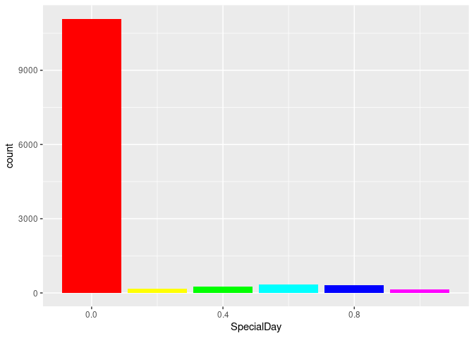

purchase_intention
================
2022-05-30

## R Markdown

## Importing Libraries

``` r
library("data.table")
library("caret")
```

    ## Loading required package: ggplot2

    ## Loading required package: lattice

``` r
library(lattice)
library("GGally")
```

    ## Registered S3 method overwritten by 'GGally':
    ##   method from   
    ##   +.gg   ggplot2

``` r
library(ggplot2)
library(corrplot)
```

    ## corrplot 0.92 loaded

``` r
library(rattle)
```

    ## Loading required package: tibble

    ## Loading required package: bitops

    ## Rattle: A free graphical interface for data science with R.
    ## Version 5.4.0 Copyright (c) 2006-2020 Togaware Pty Ltd.
    ## Type 'rattle()' to shake, rattle, and roll your data.

``` r
library("gbm")
```

    ## Loaded gbm 2.1.8

## Importing data file

``` r
data = fread("online_shoppers_intention.csv")
```

\##check dataset description and summary

``` r
str(data)
```

    ## Classes 'data.table' and 'data.frame':   12330 obs. of  18 variables:
    ##  $ Administrative         : int  0 0 0 0 0 0 0 1 0 0 ...
    ##  $ Administrative_Duration: num  0 0 0 0 0 0 0 0 0 0 ...
    ##  $ Informational          : int  0 0 0 0 0 0 0 0 0 0 ...
    ##  $ Informational_Duration : num  0 0 0 0 0 0 0 0 0 0 ...
    ##  $ ProductRelated         : int  1 2 1 2 10 19 1 0 2 3 ...
    ##  $ ProductRelated_Duration: num  0 64 0 2.67 627.5 ...
    ##  $ BounceRates            : num  0.2 0 0.2 0.05 0.02 ...
    ##  $ ExitRates              : num  0.2 0.1 0.2 0.14 0.05 ...
    ##  $ PageValues             : num  0 0 0 0 0 0 0 0 0 0 ...
    ##  $ SpecialDay             : num  0 0 0 0 0 0 0.4 0 0.8 0.4 ...
    ##  $ Month                  : chr  "Feb" "Feb" "Feb" "Feb" ...
    ##  $ OperatingSystems       : int  1 2 4 3 3 2 2 1 2 2 ...
    ##  $ Browser                : int  1 2 1 2 3 2 4 2 2 4 ...
    ##  $ Region                 : int  1 1 9 2 1 1 3 1 2 1 ...
    ##  $ TrafficType            : int  1 2 3 4 4 3 3 5 3 2 ...
    ##  $ VisitorType            : chr  "Returning_Visitor" "Returning_Visitor" "Returning_Visitor" "Returning_Visitor" ...
    ##  $ Weekend                : logi  FALSE FALSE FALSE FALSE TRUE FALSE ...
    ##  $ Revenue                : logi  FALSE FALSE FALSE FALSE FALSE FALSE ...
    ##  - attr(*, ".internal.selfref")=<externalptr>

``` r
head(data)
```

    ##    Administrative Administrative_Duration Informational Informational_Duration
    ## 1:              0                       0             0                      0
    ## 2:              0                       0             0                      0
    ## 3:              0                       0             0                      0
    ## 4:              0                       0             0                      0
    ## 5:              0                       0             0                      0
    ## 6:              0                       0             0                      0
    ##    ProductRelated ProductRelated_Duration BounceRates ExitRates PageValues
    ## 1:              1                0.000000  0.20000000 0.2000000          0
    ## 2:              2               64.000000  0.00000000 0.1000000          0
    ## 3:              1                0.000000  0.20000000 0.2000000          0
    ## 4:              2                2.666667  0.05000000 0.1400000          0
    ## 5:             10              627.500000  0.02000000 0.0500000          0
    ## 6:             19              154.216667  0.01578947 0.0245614          0
    ##    SpecialDay Month OperatingSystems Browser Region TrafficType
    ## 1:          0   Feb                1       1      1           1
    ## 2:          0   Feb                2       2      1           2
    ## 3:          0   Feb                4       1      9           3
    ## 4:          0   Feb                3       2      2           4
    ## 5:          0   Feb                3       3      1           4
    ## 6:          0   Feb                2       2      1           3
    ##          VisitorType Weekend Revenue
    ## 1: Returning_Visitor   FALSE   FALSE
    ## 2: Returning_Visitor   FALSE   FALSE
    ## 3: Returning_Visitor   FALSE   FALSE
    ## 4: Returning_Visitor   FALSE   FALSE
    ## 5: Returning_Visitor    TRUE   FALSE
    ## 6: Returning_Visitor   FALSE   FALSE

``` r
summary(data)
```

    ##  Administrative   Administrative_Duration Informational    
    ##  Min.   : 0.000   Min.   :   0.00         Min.   : 0.0000  
    ##  1st Qu.: 0.000   1st Qu.:   0.00         1st Qu.: 0.0000  
    ##  Median : 1.000   Median :   7.50         Median : 0.0000  
    ##  Mean   : 2.315   Mean   :  80.82         Mean   : 0.5036  
    ##  3rd Qu.: 4.000   3rd Qu.:  93.26         3rd Qu.: 0.0000  
    ##  Max.   :27.000   Max.   :3398.75         Max.   :24.0000  
    ##  Informational_Duration ProductRelated   ProductRelated_Duration
    ##  Min.   :   0.00        Min.   :  0.00   Min.   :    0.0        
    ##  1st Qu.:   0.00        1st Qu.:  7.00   1st Qu.:  184.1        
    ##  Median :   0.00        Median : 18.00   Median :  598.9        
    ##  Mean   :  34.47        Mean   : 31.73   Mean   : 1194.8        
    ##  3rd Qu.:   0.00        3rd Qu.: 38.00   3rd Qu.: 1464.2        
    ##  Max.   :2549.38        Max.   :705.00   Max.   :63973.5        
    ##   BounceRates         ExitRates         PageValues        SpecialDay     
    ##  Min.   :0.000000   Min.   :0.00000   Min.   :  0.000   Min.   :0.00000  
    ##  1st Qu.:0.000000   1st Qu.:0.01429   1st Qu.:  0.000   1st Qu.:0.00000  
    ##  Median :0.003112   Median :0.02516   Median :  0.000   Median :0.00000  
    ##  Mean   :0.022191   Mean   :0.04307   Mean   :  5.889   Mean   :0.06143  
    ##  3rd Qu.:0.016813   3rd Qu.:0.05000   3rd Qu.:  0.000   3rd Qu.:0.00000  
    ##  Max.   :0.200000   Max.   :0.20000   Max.   :361.764   Max.   :1.00000  
    ##     Month           OperatingSystems    Browser           Region     
    ##  Length:12330       Min.   :1.000    Min.   : 1.000   Min.   :1.000  
    ##  Class :character   1st Qu.:2.000    1st Qu.: 2.000   1st Qu.:1.000  
    ##  Mode  :character   Median :2.000    Median : 2.000   Median :3.000  
    ##                     Mean   :2.124    Mean   : 2.357   Mean   :3.147  
    ##                     3rd Qu.:3.000    3rd Qu.: 2.000   3rd Qu.:4.000  
    ##                     Max.   :8.000    Max.   :13.000   Max.   :9.000  
    ##   TrafficType    VisitorType         Weekend         Revenue       
    ##  Min.   : 1.00   Length:12330       Mode :logical   Mode :logical  
    ##  1st Qu.: 2.00   Class :character   FALSE:9462      FALSE:10422    
    ##  Median : 2.00   Mode  :character   TRUE :2868      TRUE :1908     
    ##  Mean   : 4.07                                                     
    ##  3rd Qu.: 4.00                                                     
    ##  Max.   :20.00

## check for missing values

``` r
sum(is.na((data)))
```

    ## [1] 0

\##changing column type of logical into int then as factor

``` r
data$Revenue <- ifelse(data$Revenue ==TRUE,1,0)
data$Revenue = as.factor(data$Revenue)
data$Weekend <- ifelse(data$Weekend ==TRUE,1,0)
data$Weekend = as.factor(data$Weekend)
```

\##Performed encoding of variables by changing categorical variables
into factors

``` r
data$Browser = as.factor(data$Browser)
data$OperatingSystems  = as.factor(data$OperatingSystems)
data$Region  = as.factor(data$Region)
data$TrafficType = as.factor(data$TrafficType)
data$VisitorType = as.factor(data$VisitorType)
```

# Exploratory Data Analysis

\##plotting the correlation graph to check correlation between different
features

``` r
correlation <- cor(data[,c(1:10)]) 
corrplot(correlation, method = "shade", type = "lower",diag = FALSE)
```

<!-- -->

## plotting relation between Bounce rate and exit rate

``` r
ggplot(data = data,aes(x = BounceRates, y = ExitRates))+ 
  geom_point(mapping = aes(color = Revenue)) + 
  geom_smooth(se = TRUE, alpha = 0.5,color="blue",method="lm")+theme()
```

    ## `geom_smooth()` using formula 'y ~ x'

<!-- -->

## bar graphs for Revenue

``` r
ggplot(data, aes(x = Revenue,fill=Revenue))+geom_bar()
```

<!-- -->

## bar graphs Revenue vs Visitor Type

``` r
ggplot(data, aes(x =VisitorType,fill=Revenue))+geom_bar()
```

<!-- -->

## bar graphs for TrafficType

``` r
ggplot(data, aes(x = TrafficType,fill=Revenue))+geom_bar()
```

<!-- -->

## bar graphs for Region

``` r
ggplot(data, aes(x = Region,fill=Revenue))+geom_bar(fill=rainbow(9))
```

<!-- -->

## bar graphs for Special Day

``` r
ggplot(data, aes(x = SpecialDay,fill=Revenue))+geom_bar(fill=rainbow(6))
```

<!-- -->

## violin plot

``` r
ggplot(data, aes(x = ProductRelated,y=Revenue))+geom_violin(trim = FALSE)
```

<!-- -->

# Model Implementation

# set seed

``` r
set.seed(12345678)
```

\##splitting the data into training and testing set

``` r
training = createDataPartition(y = data$Revenue, p = 0.75, list = FALSE)
train_set = data[training, ]
test_set = data[-training, ]
```
